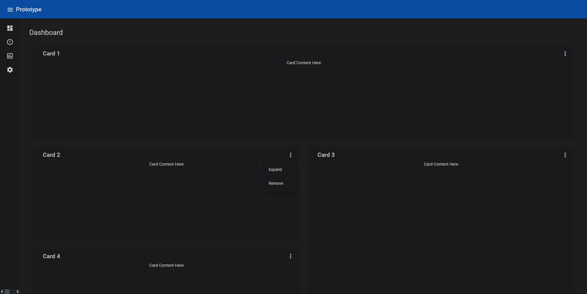
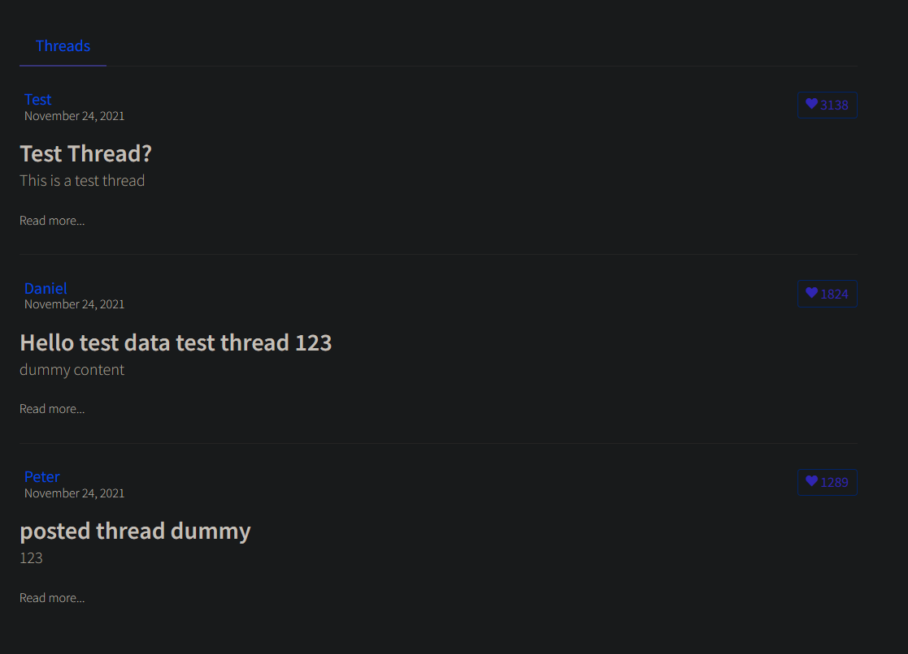
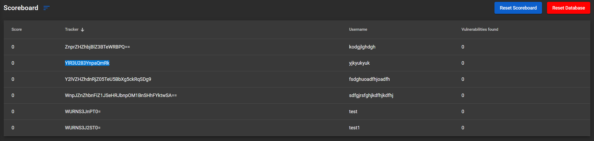
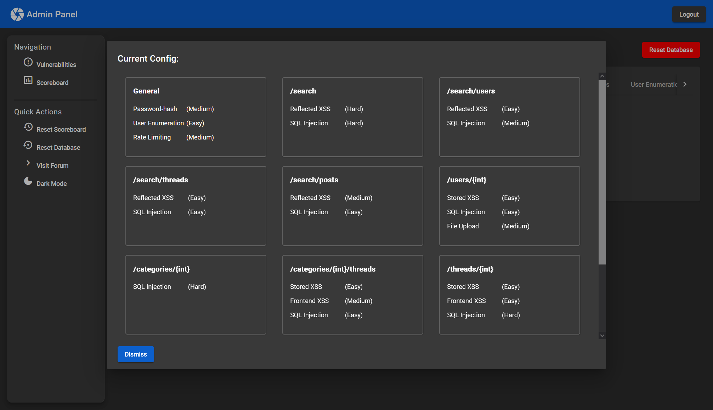
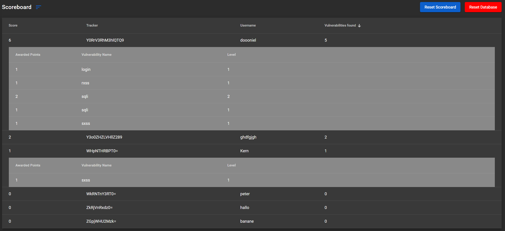

# Unsicheres Web-Forum für die Lehre - Dokumentation

### Daniel Becker

## Frontend

## Entwickeln der Prototypen; treffen der Designentscheidungen; entwickeln, implementieren und testen fast aller Komponenten und Service

## Anforderungen an das Frontend

Wie durch den Projekttitel „Unsicheres Web-Forum“ beschrieben, wird ein Forum benötigt. Mit Blick auf das GitHub Projekt
„DAMN VULNERABLE WEB APPLICATION“ – ein Projekt das, ähnlich unserem, Schwachstellen in einer Webseite integrierte, um
einen sehr Praxisnahen Lernprozess zu ermöglichen – wurde auch schnell ersichtlich, dass eine unserer Anforderungen ein
deutlich moderneres Design sein sollte.


Um einen generellen Überblick über Funktionen und Designstandards eines Forums zu erhalten, wurde zuallererst nach
Paradebeispielen eines guten Forums gesucht. Dies bezog sich sowohl auf die gebotene Funktionalität als auch auf die
Userexperience und generelles Design. Das vielversprechendste Forum, das gefunden wurde, war das
von <https://xenforo.com/>. XenForo ist ein Anbieter, der auch vorgefertigte Foren für Unternehmen anbietet und sowohl ein
übersichtliches und modernes UI, als auch sehr viele funktionale Features bietet.

<p float="left">


</p>

Hieraus konnte sich ein grober Überblick über die nötigen Features, Struktur und Designelemente gemacht werden, die in
unserem Endresultat benötigt werden. Die Forum Funktionen sollten eine vereinfachtere Version des XenForo Forums werden.
Intuitives und Modernes Design standen an erster Stelle. Das Feature Set, bezogen auf die Modellierung, sollte
vereinfacht sein, weshalb sich auf eine Aufteilung in Kategorien, Threads und Posts geeinigt wurde. Bei allen anderen
Funktionalitäten, wie z.B. Userprofile, Navigation der Seite, gegebene Zusatz Informationen wurde sich stehts an XenForo
und vBulletin orientiert. Da das Forum nur einen Teil des endgültigen Produkts wiedergibt hielten wir es für kein
Problem uns stärker hieran zu orientieren.

Durch das sammeln der Anforderugen konnte auch besser eingegrenzt werden welche Technologien im Frontend benötigt
werden.

## Verwendete Technologien

### Angular

Da jeder der Teammitglieder bereits Erfahrungen in Angular sammeln konnte und die Funktionalität des Frameworks auch
alles bot, dass man beim Sammeln der Anforderungen als mögliche Problempunkte und benötigte Features interpretierte,
wurde sich hierfür entschieden.

### Angular Material

Die Angular Material Library erweitert Angular um viele Erleichterungen und Designelemente in der Frontendentwicklung.

### Bootstrap

Das Bootstrap Framework wird für sein deutlich einfacheres und überlegeneres Grid-System im Vergleich zu Angular
genutzt. Es ermöglicht Komponenten wie der Forum-Hauptseite und dem Admin Panel mit beliebigen Bildschirmgrößen
umzugehen. Selbst auf Tablets und kleineren Displays ist das Frontend ohne Probleme nutzbar

## Prototypen

Als sich grob auf die verwendeten Technologien geeinigt wurde erstellte ich mehrere Prototypen, in denen auch weitere
Librarys und Frameworks getestet wurden. Da man es aber vermeiden wollte zu viele verschiedene externe Bibliotheken und
Frameworks für minimale Verbesserungen und Vereinfachungen einzubinden wurde hier auch vieles wieder gestrichen.
Erwähnenswert waren noch *ngx-charts* und *ng2-charts*, um die Auswertung der gefundenen Schwachstellen schöner zu
visualisieren, als auch *ngx-virtual-scroller* für ein deutlich einfacheres Tabellensystem.

<p float="left">
  
  
</p>

## Das Endprodukt

### Cross-Site-Scripting (XSS) in Angular

Um XSS in Angular zu ermöglichen, müssen sämtliche Sicherheitsfeatures von Angular umgangen werden. Da dies bei XSS aber
selbst mit Angulars eigenem *DOM Sanitizer bypasser* nicht möglich war musste eine Kombination aus Workarounds gefunden
werden um XSS in die DOM zu injecten.

Schlussendlich konnte mit Aktualisierungen an den richtigen Punkten auf Angular Structural Directives Änderungen
eingegangen werden. Dies ermöglichte das konsistentes finden der HTML Elemente im HTML-Tree.

Des Weiteren konnte die herkömmliche, in Angular blockierte, Variante der Injection durch eine Kombination
durch `appendChild` und `createContextualFragment` umgangen werden.

### XSS Frontend-Filter

Im Vergleich zum Backend-Filter unterscheidet sich der Frontendfilter dadurch, dass er nur 2 echte Schwierigkeitsstufen
hat. Beim der höchsten Stufe („unmöglich“) switcht Angular auf eine Verarbeitung der Daten durch Angular Data Bindings,
welche XSS vollständig unterbinden.

### Backend Communication

Die Kommunikation mit dem Backend wird, bis auf Authorization Requests die in ihrem eigenen Service ausgelagert wurden,
in einem einheitlichen Service gemanaged. Dieser Service sorgt fuer das passende Request Body Format, parsed Response
Daten, falls nötig, in das richtige Frontend Model Format und bietet ein generelles Error Management auf das im nächsten
Absatz genauer eingegangen wird.

### Schwachstellenbezogene Kommunikation

Um Schwachstellen zu tracken, User zu informieren und Schwachstellen im Frontend scharfzuschalten oder zu ändern werden
folgende Schritte unternommen:

- Es gibt eine besondere Route (`GET .../c?r=`) um spezifische Schwachstellen abzufragen und deren Schwierigkeitsstufe
  zu erhalten. Hierdurch werden die XSS Frontendfilter eingestellt und der oben erwähnte XSS Workaround aktiviert.

- Backend sendet einen Header mit, durch den festgestellt wird, ob eine Schwachstelle ausgelöst wurde. Falls das der
  Fall ist, wird eine Animation abgespielt, um den User zu benachrichtigen.
  

### Error Management

Es wurde ein generelles Error Management eingeführt, gekoppelt mit Benachrichtigungen die die Nutzer über Responses des
Backends informiert.

Abgedeckt werden 403, 404, 409, 410, 418, und 429. Wobei hier manche HTTP Response Status Codes eine andere Bedeutung
haben als in ihrer Spezifikation vorgegeben.

Das generelle Management wird in machen Komponenten nochmal aufgebrochen, um spezifisch auf gewissen Schwachstellen
einzugehen.
<p float="left">
  
  
</p>

### User und Admin Authentication mit Interceptorn

Angular bietet Interceptor, um routenspezifisch Header mitzusenden. Dies wird für das generelle Managen von Tokens
verwendet. User und Admin haben unterschiedliche lokale Tokens welche im Backend zur Authentication von Requests genutzt
werden.

### Angular Observables und Async pipe

Angular returned bei Backend Calls Observables. Diese können Asynchron aufgerufen werden um Platzhaltercontent während
des Ladens anzuzeigen. Dies wird in diesem Projekt vielfältig eingesetzt. „Loading“ Messages, als auch Loading Rotator
werden verwendet, um dem User zu signalisieren, dass der Request eingegangen ist und gerade verarbeitet wird.

### Tracking mit Cookies

Ein Cookie wird genutzt, um dem Professor eine klare Zuweisung der Studenten zu ermöglichen. Um zu signalisieren, dass
der Cookie auch wirklich nur zum Tracken genutzt wird, wurden folgende Schritte unternommen:

- Einmalige Benachrichtigung beim setzen des Cookies.

  

- Professor kann Studenten Cookie wiedergeben.

  

- Einfache Möglichkeit Cookie für Drittanwendungen zu extrahieren.

  

### Das Admin Panel

Das Admin Panel ist das Herzstück der Applikation aus Sicht des Professors. Hier können die Schwachstellen gesetzt, die
aktuelle Konfig ausgegeben und die Studierenden getracked werden.

- Schwachstellen: In dieser Komponente kann der Professor die Schwierigkeit(en) der jeweiligen Schwachstelle wählen und
  erhält weitere Informationen darüber was die Schwierigkeitsstufen beeinflussen. Hier bestehet auch die Möglichkeit die
  Datenbank auf den Startzustand zurückzusetzen.

  

- Konfiguration: Es kann sich auch eine Ansicht ueber die Zurzeit aktive Konfiguration ausgegeben werden. Hier wird
  genau beschrieben auf welchem API Endpunkt welche Schwachstelle auf welchem Schwierigkeitsgrad aktiv ist.

  

- Scoreboard: Hier werden alle Informationen zu den Studierenden ausgegeben. Der gewählte Name, Cookie, Gesamtpunktzahl
  und welche spezifischen Schwachstellen gefunden wurden

  

- Toolbar: Die Toolbar bietet neben der Navigation zwischen Scoreboard und Schwachstellen auch Aktionen aus den
  jeweiligen Komponenten, die häufig benötigt werden.

### Design mit Angular Material

Angular Material bietet ein einheitliches und globales Styling-Pattern, welches die Integration eines sauberen und
einheitlichen Designs einfacher gestaltet. Durch das *css* Superset *scss* kann dies mit Funktionen so weit vereinfacht
werden, dass auch Globale Style Änderung im Livebetrieb, wie z.B. ein togglebarer Dark-Mode, sehr einfach umgesetzt
werden können.


Des weiteren bietet Angular Material ein breiter repartuar an einfach integrierbaren Komponenten, wie Tabellen, Buttons,
Panels, Fortschrittsindikatoren, Effekte und Icons.


### Benachrichtigungen

Auch sehr wichtig war es den Usern, als auch den Admins Benachrichtigungen zu senden um:

- genauere Informationen anzuzeigen

  <p float="left">
    
    
    
    
  </p>

- Seitennutzer über Aktivitäten hinzuweisen, die im Backend stattfinden, bzw. längere Wartezeiten beinhalten

  

- Kontextmenü-Optionen anzubieten

  

### Fazit

Im Großen und Ganzen war es für ein erstes selbstgemanagtes Teamprojekt zumindest kein totaler Flugzeugabsturz. Die
wichtigste Lektion, die ich persönlich aus dem Projekt mitnehmen konnte, war, dass der Managementfaktor viel größer ist
als gedacht. Der hohe Zeitaufwand der mit Besprechungen, Aufgabenverteilung, einhalten von Deadlines und Kommunikation
bzw. Konfliktlösung innerhalb des Teams einhergeht wurde absolut unterschätzt. Auch Aufgaben, die nur in Abhängigkeit zu
anderen Teammitgliedern gelöst werden konnten und die dadurch entstandenen Wartezeiten waren bedenklich hoch und
Fehlkalkuliert. In der Zukunft werden Managementfaktoren genauer und großzügiger einkalkuliert.

Chris Reichel

## Filtering, Monitoring und das Scoreboard

### Unterstützte Schwachstellen und Einstellungen

Da diese Anwendung für Vorlesungen gedacht ist, kann ein\*e Administrator\*in (im Regelfall der/die Professor\*in) die
Schwierigkeit für bestimmte Verwundbarkeiten nach Wunsch einstellen.

Die folgenden Verwundbarkeiten und anderweitigen Schwierigkeitseinstellungen werden unterstützt:

#### SQL Injection

Da das Back-End eine SQL-Datenbank nutzt, kann ein Angreifer die SQL-Grammatik in Anfragen ausnutzen, um eigene
Datenbankanfragen auszuführen. Würde man beispielsweise den Nutzer mit der ID 1 anfordern, würde das SQL-Statement, das
an die Datenbank geschickt wird, etwa "SELECT * FROM users WHERE id = 1" lauten. Fragt man nun stattdessen den Nutzer
mit der ID "1 OR 1=1" an, so liest sich der WHERE-Teil des Statements als "WHERE id = 1 OR 1=1", was überall wahr ist,
weshalb dann jeder Eintrag zurückgegeben wird.

Die verschiedenen unterstützten Schwierigkeitsgrade werden in der "Filtering"-Sektion genauer behandelt.

#### Cross-Site-Scripting(XSS)

Da das Forum nutzergenerierte Inhalte enthält, kann ein Angreifer in veröffentlichte Inhalte HTML-Tags einfügen, um
eigenen Code ausführen zu können. So könnte man beispielsweise einen Nutzernamen
wie ``Albert<script>alert('Hallo!')</script>`` wählen, was auf einer unsicheren Webseite ein Pop-Up mit dem Text "
Hallo!" erzeugen würde, wann immer der Nutzername angezeigt wird.

Die verschiedenen unterstützten Schwierigkeitsgrade werden in der "Filtering"-Sektion genauer behandelt.

#### Unsicherer File Upload

Da Nutzer für ihre Konten Profilbilder hochladen können, kann man versuchen, nicht-Bilddateien (wie z.B. ausführbare
Dateien mit böswilligem Code) statt Bildern hochzuladen.

Die verschiedenen unterstützten Schwierigkeitsgrade werden in der "Filtering"-Sektion genauer behandelt.

#### Password Hashing

Passwörter werden (meistens) nicht als Klartext gespeichert, sondern mit einer Hashfunktion verschlüsselt, die im
Idealfall nicht reversibel sein sollte. Diese gehashten Passwörter können von Angreifern auf andere Methoden, wie
beispielsweise SQL Injection, aus der Datenbank geholt werden und bei einem reversiblen Algorithmus wieder in
Klartextpasswörter übersetzt werden. Die folgenden (größtenteils) reversiblen Hash-Algorithmen werden unterstützt:

##### Schwierigkeitsgrade

- 1: Keine Hash-Funktion. Passwörter werden als Klartext gespeichert.
- 2: Der (veraltete) Message-Digest 5 (MD5) Hash-algorithmus wird verwendet, um Passwörter zu verschlüsseln.
- 3: Der (veraltete) Salted Hash Algorithm 1 (SHA-1) Hash-algorithmus wird verwendet, um Passwörter zu verschlüsseln.
- 4: Der Salted Hash Algorithm 256 (SHA-256) Hash-algorithmus wird verwendet, um Passwörter zu verschlüsseln. Dieser
  Algorithmus ist zwar nicht unmöglich, aber schwer rückgängig zu machen, gerade im Kontext einer Vorlesung.

#### User Enumeration

Versuche, sich via Brute-Force-Attacke einzuloggen, sind einfacher, wenn ein Angreifer weiß, ob ein Konto überhaupt
existiert. Ansonsten kann es passieren, dass mit viel Zeit und Energie versucht wird, das Passwort eines nichtexistenten
Kontos zu erraten. Daher gibt es verschiedene Optionen, wie Angreifer wissen können, ob ein Konto existiert:

##### Schwierigkeitsgrade

- 1: Einige Nutzer werden an der Seite der Website aufgelistet. Bei fehlgeschlagenen Anmeldeversuchen wird dem Nutzer
  mitgeteilt, ob der Nutzername oder das Passwort falsch war.
- 2: Bei fehlgeschlagenen Anmeldeversuchen wird dem Nutzer mitgeteilt, ob der Nutzername oder das Passwort falsch war.
- 3: Bei fehlgeschlagenen Anmeldeversuchen wird dem Nutzer eine generische "Login fehlgeschlagen!"-Nachricht ausgegeben.

#### Rate Limiting

Brute-Force-Attacken können ausgebremst werden, indem die Geschwindigkeit, in der Anfragen geschickt werden dürfen,
limitiert wird. Daher werden verschiedene Stufen an Rate-Limiting unterstützt - keine davon sollte einen legitimen
Nutzer beeinträchtigen.

##### Schwierigkeitsgrade

- 1: Jeder Nutzer darf bis zu 10000 Anfragen pro Minute schicken. Da diese Zahl unrealistisch hoch ist, kann das als "
  unbegrenzt" verstanden werden.
- 2: Jeder Nutzer darf bis zu 120 Anfragen pro Minute schicken.
- 3: Jeder Nutzer darf bis zu 60 Anfragen pro Minute schicken.

### Middleware

Damit die Schwierigkeitseinstellungen und das Scoreboard funktionieren können, müssen alle gesendeten Anfragen nach den
entsprechenden Verwundbarkeiten gefiltert und geprüft werden.

Umgesetzt wird das mit Laravels "Middleware"-Feature:
Jede Anfrage geht eine Sammlung an Middlewares durch, die sie verarbeiten, bevor sie an die Controller durchgereicht
wird, die dann die gesendeten Daten in der Datenbank speichern o.Ä., wie an anderen Orten in dieser Dokumentation
erklärt wird.


Für Filtering und Monitoring wurden zwei Middlewares geschrieben, ein dedizierter Filter und ein dedizierter Monitor.

### Filtering von Anfragen

#### SQL Injection

SQL Injection wird auf zweierlei Arten gefiltert:

Erstens prüft der Filter nach den Zeichenfolgen "--" und "##" - diese kommentieren in SQLite das Ende eines Statements
aus, was bei manchen Formen von SQL Injection notwendig ist, damit das resultierende SQL-Statement noch syntaktisch
korrekt ist.

Zweitens wird nach der untenstehenden Liste von SQLite-Schlüsselwörtern gefiltert:

"and", "or", "not", "union", "benchmark", "sleep"

Diese könnten genutzt werden, um aus einer Anfrage zusätzliche Informationen zu ziehen.

##### Schwierigkeitsgrade

- 1: Keinerlei Filter.
- 2: Der Filter durchsucht den Textkörper der Anfrage sowie die Query-Parameter einmal nach "--" und "##" und entfernt
  den entsprechenden Text einmal. Eine Anfrage mit "----" würde nach dem Filter also wieder korrekt "--" beinhalten.
- 3: Der Filter durchsucht den Textkörper der Anfrage sowie die Query-Parameter wiederholt nach "--" und "##" und
  entfernt alle Vorkommnisse davon. Die URI der Anfrage wird einmalig nach SQLite-Schlüsselwörtern gefiltert - eine
  Anfrage mit "oorr" würde also an dieser Stelle nach dem Filter "or" beinhalten.
- 4: Der Filter durchsucht den Textkörper der Anfrage sowie die Query-Parameter wiederholt nach "--" und "##" sowie die
  URI wiederholt nach SQLite-Schlüsselwörtern und entfernt alle Vorkommnisse davon.

Findet man andere für bestimmte Arten von Anfragen (z.B. POST-Anfragen) relevante Escape-Strings (wie hier "--" oder
"##"), lassen sich diese im Filter und Monitor recht einfach einfügen, indem man das $escape_strings-Array entsprechend
abändert.

#### Cross-Site-Scripting(XSS)

Cross-Site-Scripting wird auf zwei Arten gefiltert, sowohl nur nach ``<script>``- bzw. ``</script>``-Tags spezifisch als
auch nach allen ``<``/``>``-Zeichen, je nach Schwierigkeit.

Es gibt insgesamt drei XSS-Filter:

- Einer, der den Textkörper einer Anfrage prüft, falls z.B. ein Nutzer mit XSS im Nutzernamen erstellt werden soll ("
  stored XSS")
- Einer, der die Query-Parameter durchsucht, falls z.B. eine Suchanfrage XSS enthält ("reflected XSS")
- Einer, der im Front-End den Textkörper überprüft - dieser Filter könnte mithilfe von Man-In-The-Middle-Attacken, bei
  denen eine Anfrage über einen Client wie Postman statt über die Website selbst geschickt wird, vermieden werden.

##### Schwierigkeitsgrade

- 1: Keinerlei Filter.
- 2: Der Filter durchsucht den Text einmal nach ``<script>``- und ``</script>``-Tags und entfernt sie einmal - eine
  Anfrage, die ``<scr<script>ipt>`` enthält, würde nach dem Filter also ``<script>`` enthalten, ein
  einfacher ``<script>``-Tag würde herausgefiltert werden.
- 3: Der Filter durchsucht den Text wiederholt nach ``<script>``- und ``</script>``-Tags und entfernt sie wiederholt.
  Andere HTML-Tags wie ``<button>`` werden weiterhin ignoriert.
- 4: All ``<`` and ``>`` characters are filtered out. Additionally, the frontend prevents tags being injected into the
  website.
- 4: Alle ``<`` und ``>`` werden ausgefiltert und das Front-End verhindert, dass Tags in die DOM eingefügt werden, wie
  im Frontend-Teil dieser Dokumentation genauer erklärt.

#### Insecure File Upload

Profilbilder werden je nach Schwierigkeit auf verschiedene Arten gefiltert. Erkennt der Filter eine illegale Datei (die
also weder vom Typ GIF, noch JPEG, noch PNG ist), wird eine Fehlermeldung zurückgegeben und die Anfrage nicht weiter
bearbeitet.

##### Schwierigkeitsgrade

- 1: Keinerlei Filter.
- 2: The filter checks for the data type of the encoded file using the file ending.
- 2: Der Filter prüft den Datentyp der versendeten Datei, indem die Dateiendung überprüft wird.
- 3: Der Filter überprüft die Magic Bytes der Datei, also die ersten paar Bytes - diese definieren den tatsächlichen
  Datentyp unabhängig von der Dateiendung.

### Monitoring ausgenutzter Schwachstellen

#### SQL Injection

Eingehende Anfragen werden wie beim Filter nach "##", "--" sowie SQLite-Schlagwörtern durchsucht. Dadurch kann es zwar
theoretisch zu falsch positiven Ergebnissen bei fehlschlagenden Versuchen von SQL-Injection kommen, das zu verhindern
würde allerdings eine weitaus komplexere Lösung außerhalb des Scopes dieses Projekts erfordern - entweder durch
Ausführen der Anfrage ohne tatsächlichen Effekt auf die Datenbank und Abgleich mit erwarteten Ergebnissen oder durch
einen komplexeren SQL-Parser.

Werden in einer Anfrage mit SQL Injection Schlagwörter wie "DROP", die die Datenbank kaputt machen könnten, erkannt,
kriegt der Angreifer zwar Punkte, allerdings wird die Anfrage nicht weiter bearbeitet, damit die Datenbank nicht
durchgängig zurückgesetzt werden muss.

#### Cross-Site-Scripting (XSS)

Für Cross-Site-Scripting wird mithilfe von zwei Regular Expressions nach validen HTML-Tags gesucht:

``<.*>.*</.*>`` erkennt Tags, die einen öffnenden und schließenden Tag haben, wie zum
Beispiel ``<script>alert('Hallo!')</script>``.

``<.*/>`` erkennt Tags, die nur aus einem Tag bestehen, wie zum Beispiel ``<button onClick="alert('Hallo!')">``

#### Unsicherer File Upload

Dateien werden wie bei maximaler Schwierigkeit beim Filter auf ihre Magic Bytes überprüft.

#### Log-ins in vorgefertigte Konten

Dieses Tracking passiert nicht in der Monitor-Middleware, sondern im für Logins verantwortlichen Controller - bei
erfolgreichem Login wird geprüft, ob der eingeloggte Nutzer einer der vordefinierten Nutzer ist. Dadurch wird Scoring
für Fälle wie erfolgreiches Brute-Forcing realisiert - da es hier keine direkt filter- oder erkennbare Aktion gibt (wie
z.B. bei XSS), werden diese Fälle dadurch abgefangen.

### Scoreboard

Damit das Scoreboard angezeigt werden kann, müssen zwei Aufgaben vom Back-End erfüllt werden: Ausnutzung von
Schwachstellen muss gespeichert und einem Angreifer zugeordnet werden können.

#### Angreifer identifizieren

Ursprünglich sollten Angreifer mithilfe ihrer IP-Adresse identifiziert werden, da diese praktisch einzigartig ist. Da
der Frontend-Server von Angular allerdings einen Reverse-Proxy nutzt und damit die IP-Adresse von Nutzern maskiert, war
das keine Option. Stattdessen wird nun ein Cookie verwendet, der Angreifern beim ersten Betreten der Webseite zugeteilt
wird.

Sämtliche Anfragen ohne diesen Cookie werden vom Back-End ignoriert, um nicht zuzuordnende Angriffe zu vermeiden.

#### Ausnutzung von Schwachstellen speichern

Wird im Monitor eine Schwachstelle erkannt, so wird der Erfolg in die Datenbank geschrieben. Hierbei wird der Angreifer,
die Route, die Schwierigkeit und die Art der Schwachstelle vermerkt. Fürs Scoreboard selbst relevant sind dabei nur
Angreifer, Schwierigkeit und Art der Schwachstelle - die Route wird noch hinzugegeben, damit Doppelungen zwar verhindert
werden können
(ein Angreifer also nicht unendlich Punkte erhalten kann, indem er wiederholt die gleiche Schwachstelle ausnutzt),
allerdings die gleiche Verwundbarkeit mit der gleichen Schwierigkeit an verschiedenen Stellen ausgenutzt werden kann.

#### Ausgabe des Scoreboards

Die Ausgabe des Scoreboards läuft relativ simpel ab - Der Controller geht alle eingetragenen Attacker durch, lädt die
spezifischen Informationen zu ihren gefundenen Verwundbarkeiten
(so wird z.B. die ID einer Route, mit der sie gespeichert wird, aufgelöst und mit der URI ersetzt) und gibt diese dann
zurück.

### Konfiguration

Die Einstellungen für Administratoren werden in zwei Gruppen unterteilt: routenabhängige Schwierigkeiten wie zum
Beispiel die SQL-Schwierigkeit und routenunabhängige Schwierigkeiten wie das Passwort-Hashing. Für routenabhängige
Schwierigkeiten sind mehrere Optionen gleichzeitig möglich - so kann z.B. stored XSS für Nutzereinstellungen auf "1" und
für Thread-Titel auf "3" gestellt sein.

#### Konfiguration laden

Es gibt zwei Arten, die Konfiguration zu laden:

##### admin/vulnerabilities

Hier wird Information über alle Verwundbarkeiten, die in backend\storage\app\config\vulnerabilities.json hardcoded ist,
ausgegeben. Im Feld "checked" wird dafür gespeichert, welche Schwierigkeiten aktuell aktiv sind. Dafür werden alle
Routen, für die eine bestimmte Verwundbarkeit eine Option ist
(gespeichert in backend\storage\app\config\vulnRoutes.json), durchgegangen und die entsprechenden Schwierigkeiten auf
"true" gesetzt. Für routenunabhängige ("statische") Schwierigkeiten, bei denen nur eine Option gleichzeitig aktiv sein
kann, wird diese stattdessen einfach aus der Datenbank gezogen.

##### admin/config

Hier wird spezifische Information darüber, auf welchen Routen welche Verwundbarkeiten aktiv sind, geladen. Die Logik
hierfür ist simpler als für admin/vulnerabilities - es werden einfach alle Routen durchgegangen und die Schwierigkeiten
geladen, danach werden die statischen Schwierigkeiten geladen und angehängt.

#### Konfiguration ändern

Die Konfiguration kann auf zwei Arten verändert werden, wobei eine nur zum Debuggen gedacht ist.

##### admin/config/premade

Diese Methode ist nur zum Debuggen gedacht - hier kann eine fertige Konfiguration, bei der für jede Route die gewählten
Schwierigkeiten angegeben sind, übergeben werden, die dann die in der Datenbank gespeicherte Konfiguration überschreibt.

##### admin/config

Diese Methode wird auch vom Front-end genutzt. Hier wird für jede Einstellung angegeben, welche Schwierigkeiten
unterstützt werden sollen. Für statische (routenunabhängige) Einstellungen wird dann je die erste Schwierigkeit
übernommen, da hier immer nur eine aktiv sein kann.

Für routenabhängige Einstellungen wird zuerst für jede gewählte Schwierigkeit eine Route ausgewählt, um sicherzustellen,
dass für jede gewählte Schwierigkeit mindestens eine Route verfügbar ist. Die einzige Ausnahme hier ist der unsichere
File-Upload - hier sind nur zwei Routen für drei Schwierigkeiten verfügbar, bei Anwählen aller Schwierigkeiten wird also
eine der Schwierigkeiten nicht verwendet.

Danach werden sämtliche verbleibenden Routen durchgegangen und eine der ausgewählten Schwierigkeiten wird zugewiesen.

Für XSS wird hier zusätzlich sichergestellt, dass nicht auf der gleichen Route der Front- und Back-End-Filter für Stored
XSS aktiv sind. Hierfür wird zuerst wie oben je eine Route pro Schwierigkeit für Back-end Filter zugewiesen, danach wird
je eine Route pro Schwierigkeit für den Front-end Filter zugewiesen, wobei hier geprüft wird, ob die Schwierigkeit des
Back-end Filters gleich 4 ist - ist das nicht der Fall, so wurde die Route bereits für den Back-end Filter genutzt. Für
Routen mit Front-end Filtering wird außerdem der Back-end Filter auf Stufe 1 gesetzt. Danach werden nur für den Back-end
Filter weitere Routen zugewiesen, für den Front-end Filter gibt es also nur je Schwierigkeit eine Route.

### Lukas Hein

## Entwicklung von Posts ; Animation beim Finden von Schwachstellen

## Posts

Posts sind eine der wichtigsten Teile eines Forums und das Primäre Kommunikationsmittel des Forums. In ihnen können
Nutzer sich äußern und speziell auf vorherige Posts antworten.

### Posten

- Das Posten findet über ein Textfeld am Ende eines Thread statt. Dort können User Posts erstellen und an 
  beliebigen Stellen Posts, auf welche sie antworten, hinzufügen. 

 

### Antworten

- Das Hinzufügen von Antworten erlaubt es Benutzern besser auf vorherige Posts zu referenzieren oder 
  Aufmerksamkeit zu werfen. Posts werden beim Schreiben oder Bearbeiten eines Posts durch das klicken des 
  'Reply'-Knopfes automatisch an die Stelle im Post gesetzt, an welcher sich der Cursor zuletzt befand. 
  In diesen Antworten befindet sich jedoch, um eine gewisse Übersicht zu behalten, nur der Posttext selbst,
  andere Posts auf welche der Post antwortet.  

 

- Innerhalb des Postinhalts, der im Backend gespeicherten Inhalt der Posts, sind Antworten mit den Tags 
  '[quote=Username:PostId]...[/quote]' gekennzeichnet. Diese für das Backend serialisierte From wird dann
  im Frontend mithilfe von Regular Expressions deserialisiert und in sogenannten Blockquotes innerhalb des
  Posts an der richtigen Stelle erstellt.


- Einigen der verwendeten Regular Expressions:  
- Teilen des Inhalts in Posttext und Antworten:
```php
    const splitRegex = new RegExp("\\[quote=.*?](.*?)\\[/quote]", 'gmids');
```
- Besorgen des ersten Quote-Tags der Antwort um die nötigen Daten wie Autor und PostId zu bekommen
```php
    const replyInfoRegex = new RegExp("\\[quote=(.*?)]", 'mid');
```
- Besorgen des Usernames aus dem ersten Quote-Tag:

```php
    const userNameRegex = new RegExp("(?<=\=)(.*?)(?=\:)", 'mid');
```
  
- 
- Das anklicken der Antworten innerhalb der Posts bringt den Benutzer
  zum originalen Post.  
- Um möglicherweise auf Stellen innerhalb der Antwort hinzuweisen oder Verbesserungen durchzuführen ist es
  Autor eines Posts erlaubt, den Inhalt von Antworten innerhalb seines Posts zu verändern
- Nutzern ist es auch gestattet, durch Entfernen des sich im ersten Quote-Tag einer Anwort befindenden Doppelpunkets
  Quotes/Antworten zu erstellen welche auf keine echten Posts hinweisen und z.B. auf Aussagen zu referenzieren. Diese 
  "fake" Antworten führen deshalb bein anklicken auf keinen anderen Post.
  
### Bearbeiten von Posts

- Beim Betätigung des Knopfes 'Bearbeiten', welcher mit dem Stift-Symbol gekennzeichnet ist, wird ein Post in
  Bearbeitungszustand versetzt. In diesem Zustand wird der vorher angezeigte Inhalt wieder in den mit möglicherweise
  Tags versehenen serialisierten Zustand versetzt. Während des Bearbeitens kann der Benutzer wie beim Erstellen eines
  Posts an beliebigen Stellen Antworten auf andere Posts hinzufügen und seinen eigenen als auch den Text von Antworten
  bearbeiten. Das Beenden der Bearbeitung wird beim Betätigen des Knopfes 'Done' signalisiert. Daraufhin wird der
  Inhalt an das Backend weitergereicht und die neue Darstellung des Posts gebaut.  

 

  Es ist mit anzumerken dass:
  - Immer nur ein Post darf an einem Zeitpunkt bearbeitet werden. Die Bearbeitung weiterer Posts ist erst nach Beendung
    der derzeitigen Bearbeitung möglich.
  - Während des Bearbeitens eines Posts es nicht möglich ist Posts zu schreiben / posten

 

### Teilen

- Beim Betätigen des Knopfes 'Share' wird in den Zwischenspeicher des Benutzers die Adresse des Posts gespeichert
  was beim Aufrufen einen direkt zum Post innerhalb des Thread bewegt.

### Reporting

- Beim Betätigen des Knopfes 'Report' öffnet sich ein Dialog, in welchem sich ein Textfeld befindet, um es Benutzern 
  zu erlauben Posts zu melden. 


## Animation beim Finden von Schwachstellen

Die Animation, welche beim Finden von Schwachstellen auftritt, ist aufgebaut aus 2 Zuständen, dem 'show' und 'hide'
Zustand welche jeweils ihre eigenen Transformationen in den anderen Zustand besitzen. Neben dem erscheineneden Symbol 
werden die Worte 'You did a thing' nacheinander eingefügt und nach wenigen Sekunden wieder nacheinander entfernt.  


Das einzelne Einfügen der Worte wird durch separate Übergangsanweisungen für jedes Wort erzeugt, indem die einzelnen
verzögert voneinander beginnen.

  
Alexander Kern

## Routing und Datenbankanbindung mit Laravel

### Probleme mit Laravel und SQl injection

Laravel ist ein gutes Framework, welches für die Datenbankanbindung standardmäßig Prepared Statements in den Eloquent Modellen (siehe Beschreibung Daniel K.) nutzt.
Diese sind Perfekt für normale Anwendungen, wenn man dagegen SQL injection explizit erlauben möchte muss man das irgendwie umgehen.

#### Injection bei SELECT Statements

##### Mögliche Injections

Bei SELECT Statements sind zwei Arten von Injectons möglich:
Zum Einen kann mann sich mit `SELECT (*) FROM users WHERE id = 1 or 1=1;` alle User ausgeben lassen, obwohl mann die IDs dieser nicht kennt.
Zum Anderen ist es möglich ein Union Statement zu formen um sich Daten von andenen Tabellen oder Werte die nicht ausgegeben werden, sich ausgeben zu lassen.

##### Probleme in Laravel

Laravel hat die Funktion `find()` mit welcher man ein Eloquent model in der passenden Datenbank suchen kann. Um dies Injectable zu machen muss man sich ein "whereRaw" Statement schreiben. In diesem kann man einen kombinierten String mitgeben, welcher auch andere Statements enthalten kann.

#### Injection bei INSERT Statements

##### Mögliche Injection

In INSERT Statements ist möglich mit einer Subquery, einer Anfrage in einer Anfrage, Passwörter oder andere Daten in vorhandene Felder zu schreiben.
Ein solches Statement würde ungefähr so aussehen:
`INSERT into users (name , password, info) VALUES ('Alex', 'Secret', (SELECT password FROM users where id = 5)); --`
Nun steht in dem fled info das Passwort des Users mit der ID 5.

##### Probleme in Laravel

Für ein INSERT mit Eloquent ist es nur nötig den einkommenden Body in ein `insert()` zu stecken. Mit einem Validator kann man davor noch Bedingungen prüfen.
Um hier die Injection möglich zu machen muss man den String der Anfrage speziell zusammenbauen.
Hierbei sind folgenden Dinge zu beachten:
    1. Die zu injectenden Felder sollten nicht ganz vorne im String kommen
    2. Der String sollte Allgemeingültig für alle Ressourcen sein.
    3. Json Arrays müssen als String encoded werden.

Desweitern muss noch folgendes beachtet werden:
    1. Der Nutzer muss berechtigt sein die Ressource zu erstellen.
    2. Bei Ressourcen mit Author muss der Nutzer muss identisch oder ein Admin sein.

Das Resultat ist eine Funktion, die den Tabellennamen, ein Array der Felder der Ressource und die Request übergeben bekommt. Die Funktion Iteriert über das Array und prüft ob die Felder existieren. Wenn dies der Fall ist wird der Name des Feldes und den Wert an Verschiedene Strings angehängt. Sollte der wert ein Array sein wird dies davor in json encoded. Der Erstellzeitpunk und der Updatezeitpunk wird automatisch auf den aktuellen Zeitpunkt gesetzt.

Bestimmte Werte müssen vorher mit einem Validator überprüft werden.

#### Injection bei UPDATE Statements

##### Mögliche Injections

In UPDATE Statements ist es möglich Werte von allen Zeilen einer Tabelle zu verändern. Hierbei darf in der Tabelle keine Einzigartigen Werte geben.
Des weiteren ist eine Subquery ebenfalls möglich.

Um Daten in alle Zeilen zu schreiben muss man aus `UPDATE threads SET title="New Title" WHERE id = 5;` `UPDATE threads SET title="New Title"` machen. Nun existiert keine Beschränkung für das und jeder Thred title wird zu "New Title" geändert.
Dies ist einfach zu erreichen in dem man `;--` oder andere Syntax für SQL Kommentare anhängt.

##### Probleme in Laravel

Für ein UPDATE mit Eloquent ist es nur nötig das aktuelle Model zu suchen und anschließend den einkommenden Body in ein `->update()` zu stecken. Damit dies in der Datenbank gespeichert wird sollte man ein `-save()` ausführen. Mit einem Validator kann man davor noch Bedingungen prüfen.

Um hier die Injection möglich zu machen muss man den String der Anfrage speziell zusammenbauen.
Hierbei sind folgenden Dinge zu beachten:
    1. Die zu injectenden Felder sollten nicht ganz vorne im String kommen
    2. Der String sollte Allgemeingültig für alle Ressourcen sein.
    3. Json Arrays müssen als String encoded werden.

Desweitern muss noch folgendes beachtet werden:
    1. Der Nutzer muss berechtigt sein die Ressource zu bearbeiten.
    2. Bei Ressourcen mit Author muss der Nutzer muss identisch oder ein Admin sein.

Das Resultat ist eine Funktion, die den Tabellennamen, ein Array der Felder der Ressource und die Request übergeben bekommt. Die Funktion Iteriert über das Array und prüft ob die Felder existieren. Wenn dies der Fall ist wird der Name des Feldes und den Wert an einen String angehängt. Sollte der wert ein Array sein wird dies davor in json encoded. Der Updatezeitpunk wird automatisch auf den aktuellen Zeitpunkt gesetzt.

Bestimmte Werte müssen vorher mit einem Validator überprüft werden.

#### Injection bei DELETE Statements

##### Mögliche Injection

Bei einem DELETE Statement ist eine Injection möglich. Man kann wie bei einem WHERE Statement z.B. ein `or 1=1` anhängen um alle Daten zu Löschen.

##### Probleme in Laravel

Um dies Injectable zu machen muss man sich ein "whereRaw" Statement schreiben. In diesem kann man einen kombinierten String mitgeben, welcher auch andere Befehle enthalten kann.

### Routing mit Laravel

Routing in Laravel ist simpel.

Zuerst muss man die Routen im RouteServiceProvider registrieren. Für die Routen kann man hier ein Prefix vergeben. Sobald dies geschehen ist kann man in der registrierten Route Funktionen und Endpunkte definieren.

Als Beispiel:
`Route::get('users/{id}', 'App\Http\Controllers\UserController@getUserById');`

Hier wird in der api.php ein Endpunkt definiert, der auf `users/id` endet, und die Funtion getUserById in der Klasse UserController aufruft.
Die Funktion kann nun `id` und `request` als Werte übergeben bekommen.

Beispiel:

```php
    public function getUserById($id): UserResource|Response|AnonymousResourceCollection|Application|ResponseFactory
    {
        $user = UserController::findUser($id);
        if (!$user)
            return response('', 404);

        return UserResource::collection($user);
    }
```

Diese Funktion sucht nach einem User mit der Injectable Funktion.
Sollte hier kein Resultat kommen wird ein response mit 404 gesendet.
ansonsten wird die UserRessurce aufgerufen.

#### Ressourcen

Ressourcen in Laravel benutzt man um Objekte in eine Form zu bringen, die man ausgibt. Hier kann zum Beispiel bei einem User das Password versteckt werden, oder man baut sich Subressourcen aus übergebenen Arrays.

Beispiel:
(aus ThreadRessurce.php)

```php
    public function toArray($request): array|JsonSerializable|Arrayable
    {
        $data = $this;

        $author = (new User)->find($data->author);
        $data->author = [
            'id' => $data->author,
            'profile_picture' => $author->profile_picture,
            'name' => $author->name,
        ];

        $posts = Post::all()->where('thread_id', '=', $data->id);
        $data->posts = PostResource::collection($posts);

        return self::convertData($data);
    }
```

Hier wird der Autor und alle Posts überschrieben, um in der Ausgabe die Daten aus anderen Tabellen darzustellen.

Beispiel Resultat:

```json
{
   "id": 21,
   "title": "Community Thread 1",
   "date": "01.01.0001",
   "likedFrom": [11, 12, 135, 1553, 14, 1882, 1444, 1555, 131],
   "author":
     {
       "id": 11,
       "profilePicture": "data:image/jpeg;base64,/9j/4AAQSkZJRgABAgAAZABkAAD/7AAR...",
       "name": "TestUsername1"
     },
   "posts": [
     {
       "id": 31,
       "content": "this is a test post",
       "date": "04.01.0001",
       "likedFrom": [11, 12, 135, 1553, 14, 1882, 1444, 1555, 131],
       "author":
         {
           "id": 12,
           "profilePicture": "data:image/jpeg;base64,/9j/4AAQSkZJRgABAgAAZABkAAD/7AAR...",
           "name": "TestUsername2"
         }
     }
   ]
 }
```

Wenn hier die Daten aus dem Thread direkt ausgegeben worden wären wäre folgende Json entstanden:

```json
{
   "id": 21,
   "title": "Community Thread 1",
   "date": "01.01.0001",
   "likedFrom": [11, 12, 135, 1553, 14, 1882, 1444, 1555, 131],
   "author": 11
 }
```

Daniel Katzenberger

Peter Weiß
